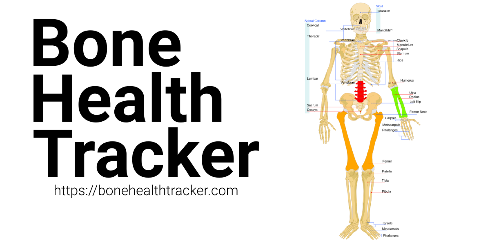

## Bone Health Tracker
Track your Bone Health, Help create better Bone Health Treatments. - [https://bonehealthtracker.com](https://bonehealthtracker.com).

### What
Bone Health Tracker helps us to **visualize our bone health** easily and helps **monitor the progress** of our bone disease treatment.

### Why
**1 in 3 women** over the age of 50 years and **1 in 5 men** will experience **osteoporotic fractures** in their lifetime. With 1 in 6 people in the world expected to be over the age 65 by 2050, We need more investment in understanding bone health and coming up with better treatments for bone health diseases.

### How
Bone Health Tracker helps us visualize and monitor our bone health through **Bone Mineral Density** scan reports and also provides a way for submitting the data **without any personal information** for bone health research.

### Demo
[](https://www.youtube.com/watch?v=5F_4vry5EJ4)
Clicking the above image would open the demo video in YouTube.

### Technical How
1. BMD report is extracted by [Amazon Textract](https://aws.amazon.com/textract/) classified by the [Amazon Comprehend Medical](https://aws.amazon.com/comprehend/medical/) in the python middleware. 
2. The medical data is processed by the parser and **any personal identifiable information is ignored**.
3. Parser returns T-Scores and BMD scores for individual organs.
4. The data is stored in a client Cookie, The Cookie is updated with new reports.
5. A chart canvas is populated using the data from the Cookie.
6. A skeleton image is populated using the data from the Cookie.
7. If the user chooses to submit the medical data for research(without any personal information), The Cookie data is converted to JSON and stored in a sqlite3 database.

## Testing Setup

### Requirements
1. Go version 1.19.2 (or)  higher.
2. Python version 3.10.6 (or) higher.

### Database
Create a sqlite3 database `bht.db` inside the `db` folder.

```
$ cd db 
$ sqlite3 bht.db.
```

### Machine Learning Server
Install the required Python packages from `requirements.txt`.
Install **uvicorn** 

```
$ pip3 install "uvicorn[standard]"
```

1. Setup [Amazon Textract](https://aws.amazon.com/textract/) and [Amazon Comprehend Medical](https://aws.amazon.com/comprehend/medical/) using CLI.

2. Run the service in the bonehealthtracker folder, 

        $ cd bonehealthtracker
        $ uvicorn main:app --host 0.0.0.0 --port 8000

Note: 
1. In production, I use gunicorn with multiple workers for greater performance as found in `/backup/server_scripts/gunicorn.service`. For using [gunicorn](https://gunicorn.org/), It needs to be installed along with uvicorn as detailed earlier.


### Configuration
The configuration file is located in `/secrets/fragmenta.json`.
Sql schema is located in `db/Create-Tables.sql`.

Information on some of the configuration fields  -

1. `db`: Location of the sqlite3 db.
2. `port`: Port for the application, `3000` is set by default in the configuration.
3. `classifier_server`: **Machine Learning Server** created earlier, `[Machine Learning Server IP]:8000/classification`.


### Building the application
After ensuring Go is installed in the system,
        
        $ cd bonehealthtracker
        $ go build bonehealthtracker

### Run the application
After ensuring that the Machine Learning Server is running,

    $ ./bonehealthtracker

### Usage
1. Visit the Bone Health Tracker project domain you have set in `root_url` with set `port` e.g. `localhost.com:3000`.
2. Upload the assessment section of the Bone Mineral Density(BMD) scan test report.
   >Note: FakeData folder contains BMD sample reports for testing.

   - Assessment-1.jpg to Assessment-3.jpg are of standard format and can be uploaded in sequence to test the visualizations for Osteoporosis, Osteopenia & Normal bone density.

   - BDRS-1.png is of medical transcription type with Osteopenia.

   - BDRS-2.png is another medical transcription type with normal bone density.

### Miscellaneous Testing Notes
1. Occasionally, Amazon Comprehend Medical returns wrong order for BMD scores and thereby mismatching the BMD score for the organs. Deleting the report and Uploading it again fixes the issue.
2. Bone Health Tracker can currently display utmost 4 reports due to limitations with cookie size.

### Copyright and Licenses
© 2022 Abishek Muthian https://bonehealthtracker.com.

Private repository submitted as an entrant for [AWS Health AI Hackathon](https://awshealthai.devpost.com/).

### Open-Source Licenses
Licenses for open-source libraries used in this project.

Fragmenta: https://github.com/fragmenta licensed under [The MIT License](https://github.com/andybrewer/mvp/blob/master/LICENSE).

MVP.CSS: https://github.com/andybrewer/mvp/ licensed under [The MIT License](https://github.com/fragmenta/fragmenta-cms/blob/master/LICENSE).

fastapi: https://github.com/tiangolo/fastapi licensed under [The MIT License](https://github.com/tiangolo/fastapi/blob/master/LICENSE).

boto3: https://github.com/boto/boto3 licensed under [Apache License 2.0](https://github.com/boto/boto3/blob/develop/LICENSE).

Amazon Textract Results Parser: https://github.com/mludvig/amazon-textract-parser, A module packaged from   [aws-samples/amazon-textract-code-samples](https://github.com/aws-samples/amazon-textract-code-samples) licensed under [The MIT License](https://github.com/aws-samples/amazon-textract-code-samples/blob/master/LICENSE).


